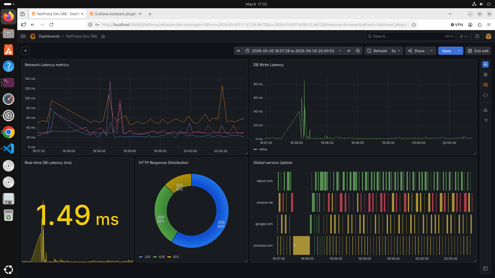

# NetPulse: Full-Stack SRE Telemetry & Observability Pipeline

### **Overview**
NetPulse is a production-grade internal telemetry API and observability pipeline. It was engineered to actively monitor external domains' network latency and uptime, bypassing standard enterprise ICMP blocks by executing raw TCP socket connections. The system demonstrates core Site Reliability Engineering (SRE) principles, including graceful degradation, connection pooling, and multi-layered OSI telemetry visualization.

---

### **Architecture Design (3-Tier + Observability)**

The system leverages a decoupled architecture, ensuring that the observability stack remains operational even if the underlying telemetry API experiences catastrophic failure. 

#### **Layer 1: Reverse Proxy (Nginx)**
* **Role:** The Ingress Gateway.
* **Function:** Binds to Port 80. It handles raw incoming TCP connections and securely routes HTTP traffic to the internal application server. Acts as the first line of defense against malformed requests.

#### **Layer 2: Application Server (Python, Flask, Gunicorn)**
* **Role:** The Telemetry Engine.
* **Function:** Binds to Port 5000 (Localhost restricted). It utilizes a WSGI Master-Worker architecture (`--workers 3`) to prevent single-threaded blocking during long network latency checks. It executes raw network probes to measure TCP (Layer 4) handshake speeds and HTTP (Layer 7) status codes. 

#### **Layer 3: Data Warehouse (PostgreSQL)**
* **Role:** The Persistent State.
* **Function:** Binds to Port 5432. Accessed strictly via a restricted service account (`sre_user`). It stores time-series telemetry data and utilizes TCP Connection Pooling to prevent connection exhaustion under heavy concurrent loads.

#### **Layer 4: Observability (Grafana)**
* **Role:** The Single Pane of Glass (NOC).
* **Function:** Binds to Port 3000. It directly queries the PostgreSQL data warehouse independently of the API, ensuring monitoring systems remain online regardless of application-layer health.

---

### **Core SRE Features Engineered**

* **Layer 4/7 Telemetry:** Standard ICMP (Ping) traffic is frequently dropped by modern cloud firewalls. This agent establishes actual TCP socket connections (Port 443) to measure true routing latency, followed by Layer 7 HTTP status code validation.
* **Cascading Failure Protection:** Implemented strict application-side database timeouts. If the PostgreSQL storage layer degrades, the Python worker threads violently drop the connection after 3000ms rather than hanging, protecting the API from resource exhaustion.
* **Zero-Downtime Migrations:** The database schema was evolved in real-time to capture TCP and DB latency metrics via `ALTER TABLE` commands without dropping legacy infrastructure data.
* **Process Isolation & Input Sanitization:** The application utilizes strict regex-based payload validation (`^[a-zA-Z0-9.-]+$`) to protect the underlying OS from command injection vulnerabilities when parsing network domains.

---

### **Errors Encountered & Resolutions**

A significant portion of this project involved debugging silent failures and data inference issues within the observability layer.

| Component | Error Encountered | Root Cause | Resolution Engineered |
| :--- | :--- | :--- | :--- |
| **Database** | Thread Hanging / Resource Exhaustion | The API would freeze indefinitely if the PostgreSQL database became unreachable, tying up Gunicorn workers. | Implemented strict **Cascading Failure Protection**. Added a hard 3000ms timeout on the `psycopg2` connection block. If the DB hangs, the application drops the connection, completes the network check, and returns a `207 Multi-Status` detailing the partial failure. |
| **Grafana** | Silent Crash / Missing Y-Axis | Time-series graphs failed to draw historical data despite successful database connections. | Discovered that schema migrations created `NULL` values in older rows. Applied strict `IS NOT NULL` sanitization in the SQL queries to ensure Grafana's type-inference engine received pure numerical data. |
| **Grafana** | Flatlining State Timeline | The visual uptime blocks merged into unreadable overlapping data points. | The SQL query was returning unpivoted raw table data. Updated the Grafana UI format from `Table` to `Time series` and implemented custom Value Mappings (e.g., `1 = 200 OK`, `2 = 503 Blocked`) to dynamically draw SRE state blocks. |
| **Grafana** | "No Data" False Positives | The dashboard reported empty metrics despite live traffic hitting the API. | Diagnosed a Timezone drift between the Local Browser, the Ubuntu VM, and PostgreSQL's internal clock. Bypassed the drift using localized query scoping and `$__timeFilter` adjustments. |